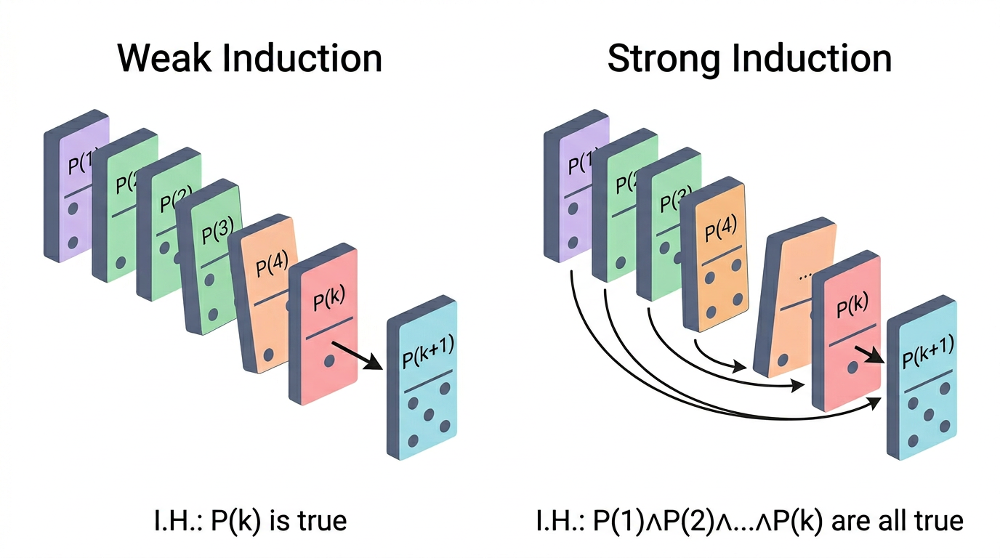

# Strong Induction

> COMP0147 Discrete Mathematics — UCL Year 1

## Weak vs Strong Induction

| | Weak induction | Strong induction |
|---|---|---|
| **I.H.** | Assume \(P(k)\) | Assume \(P(j)\) for **all** \(b \leq j \leq k\) |
| **Goal** | Prove \(P(k+1)\) | Prove \(P(k+1)\) |
| **When** | \(P(k+1)\) follows from \(P(k)\) alone | \(P(k+1)\) needs earlier cases, not just \(P(k)\) |

Both forms are logically equivalent — anything provable by one is provable by the other.

## Strong Induction Principle

\[
\bigl[P(b) \;\wedge\; \forall k \geq b\,\bigl(\bigl(P(b) \wedge P(b+1) \wedge \cdots \wedge P(k)\bigr) \rightarrow P(k+1)\bigr)\bigr] \;\longrightarrow\; \forall n \geq b,\; P(n)
\]

The induction hypothesis gives you access to **every** previous case, not just the immediately preceding one.

## Example: Every \(n \geq 2\) Has a Prime Divisor

**Why strong induction?** Knowing "\(k\) has a prime divisor" tells us nothing useful about \(k+1\). We need to reason about *divisors* of \(k+1\), which are smaller but not necessarily \(k\).

- **Base:** \(P(2)\): 2 is prime, so it is its own prime divisor. ✓
- **I.H.:** Assume every integer \(j\) with \(2 \leq j \leq k\) has a prime divisor.
- **I.S.:** Consider \(k+1\).
  - If \(k+1\) is prime, done.
  - If composite, then \(k+1 = ab\) with \(2 \leq a,b \leq k\). By I.H., \(a\) has a prime divisor \(p\). Then \(p \mid a\) and \(a \mid (k+1)\), so \(p \mid (k+1)\). ✓

## Example: Stamps Problem

**Claim:** Every postage amount \(\geq 12\) cents can be formed using 4-cent and 5-cent stamps.

This requires **4 base cases** (since the recursive step reaches back 4 positions):

| Amount | Stamps |
|--------|--------|
| 12 | 3×4 |
| 13 | 2×4 + 1×5 |
| 14 | 1×4 + 2×5 |
| 15 | 3×5 |

- **I.H.:** Assume \(P(j)\) for all \(12 \leq j \leq k\), where \(k \geq 15\).
- **I.S.:** For \(P(k+1)\): since \(k+1 \geq 16\), we have \(k+1-4 \geq 12\), so \(P(k-3)\) holds by I.H. Take that combination and add one 4-cent stamp. ✓

## Example: Nim Game

**Setup:** Two piles of stones; players alternate removing any positive number of stones from one pile. The player who takes the last stone wins.

**Claim:** If both piles have the same size \(n\), the second player has a winning strategy.

- **Base:** \(P(0)\): both piles empty — first player cannot move, so second player wins. ✓
- **I.H.:** \(P(j)\) holds for all \(0 \leq j \leq k\).
- **I.S.:** Piles of size \(k+1\). Whatever first player does (removes some stones from one pile), second player mirrors the move on the other pile, leaving two equal piles of size \(j \leq k\). By I.H. second player wins from there. ✓

## Well-Ordering Principle (WOP)

> Every non-empty subset of \(\mathbb{N}\) has a **smallest element**.

**Equivalence:** The WOP, weak induction, and strong induction are all logically equivalent — any one can be derived from any other.

**Proof technique using WOP:** To prove \(\forall n \geq b,\; P(n)\), assume for contradiction that the set \(S = \{n \geq b : \neg P(n)\}\) is non-empty. By WOP, \(S\) has a smallest element \(m\). Derive a contradiction (typically by showing \(P(m)\) must hold).
