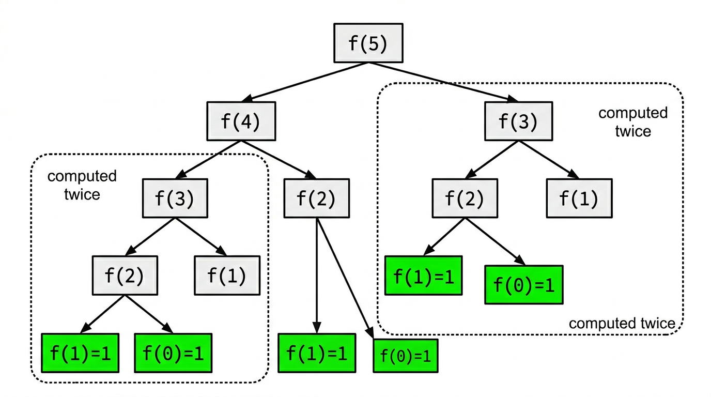

# Recursion and Structural Induction

> COMP0147 Discrete Mathematics — UCL Year 1

## Recursive Definitions

A **recursive definition** defines an object in terms of smaller instances of itself. It always has:

1. **Base step:** value(s) at the smallest input(s).
2. **Recursive step:** express the value at \(n\) in terms of values at smaller inputs.

## Recursively Defined Functions

### Factorial

\[
f(0) = 1, \qquad f(n) = n \cdot f(n-1) \text{ for } n \geq 1
\]

### Fibonacci

\[
f(0) = 1, \quad f(1) = 1, \qquad f(n) = f(n-1) + f(n-2) \text{ for } n \geq 2
\]

### McCarthy's 91 Function

\[
M(n) = \begin{cases} n - 10 & \text{if } n > 100 \\ M(M(n+11)) & \text{if } n \leq 100 \end{cases}
\]

Result: \(M(n) = 91\) for all \(n \leq 100\).

### Finding a Recursive Definition from an Explicit Formula

Given a closed-form \(a_n\), find a recurrence by computing \(a_n - a_{n-1}\) (or \(a_n / a_{n-1}\), etc.) and identifying a pattern.

## Recursively Defined Sets

A recursive set definition has three parts:

1. **Base step:** Specify initial elements.
2. **Recursive step:** Rules that produce new elements from existing ones.
3. **Exclusion rule:** Nothing is in the set unless it can be obtained by finitely many applications of (1) and (2).

### Positive Multiples of 3

- Base: \(3 \in S\).
- Recursive: if \(x \in S\), then \(x + 3 \in S\).

### Strings \(\Sigma^*\) over Alphabet \(\Sigma\)

- Base: \(\lambda \in \Sigma^*\) (the empty string).
- Recursive: if \(w \in \Sigma^*\) and \(x \in \Sigma\), then \(wx \in \Sigma^*\).

### Well-Formed Propositional Formulas

- Base: Propositional variables \(p, q, r, \ldots\) are wffs.
- Recursive: if \(\alpha, \beta\) are wffs, then so are \((\neg\alpha)\), \((\alpha \wedge \beta)\), \((\alpha \vee \beta)\), \((\alpha \rightarrow \beta)\), \((\alpha \leftrightarrow \beta)\).

## Lists (Recursive Definition)

- Base: \([\,]\) is a list.
- Recursive: if \(x\) is an element and \(xs\) is a list, then \(x : xs\) is a list.

Operations defined recursively: length, append (\(+\!\!+\)), reverse.

## Binary Trees (Recursive Definition)

- Base: A single node is a binary tree.
- Recursive: If \(T_L\) and \(T_R\) are binary trees and \(r\) is a node, then the tree with root \(r\), left subtree \(T_L\), right subtree \(T_R\) is a binary tree.

## Structural Induction

To prove a property \(P\) holds for all elements of a recursively defined set:

1. **Base:** Show \(P\) holds for each initial element.
2. **Inductive hypothesis:** Assume \(P\) holds for each element used in a construction rule.
3. **Inductive step:** Show \(P\) holds for the newly constructed element.

This mirrors the recursive definition of the set itself.

## Examples

### \(\text{rev}(xs \mathbin{+\!\!+} ys) = \text{rev}(ys) \mathbin{+\!\!+} \text{rev}(xs)\) for Lists

Structural induction on \(xs\):

- **Base** (\(xs = [\,]\)):
  \(\text{rev}([\,] \mathbin{+\!\!+} ys) = \text{rev}(ys) = \text{rev}(ys) \mathbin{+\!\!+} [\,] = \text{rev}(ys) \mathbin{+\!\!+} \text{rev}([\,])\). ✓
- **I.H.:** \(\text{rev}(xs \mathbin{+\!\!+} ys) = \text{rev}(ys) \mathbin{+\!\!+} \text{rev}(xs)\).
- **I.S.** (\(x:xs\)):
  \(\text{rev}((x:xs) \mathbin{+\!\!+} ys) = \text{rev}(x:(xs \mathbin{+\!\!+} ys))\).
  Unfold rev, apply I.H., and rearrange using associativity of \(+\!\!+\). ✓

### \(\text{links}(t) = \text{nodes}(t) - 1\) for Binary Trees

Structural induction on \(t\):

- **Base** (single node): links = 0, nodes = 1. \(0 = 1 - 1\). ✓
- **I.H.:** \(\text{links}(T_L) = \text{nodes}(T_L)-1\) and \(\text{links}(T_R) = \text{nodes}(T_R)-1\).
- **I.S.:** \(\text{links}(t) = \text{links}(T_L) + \text{links}(T_R) + 2\) and \(\text{nodes}(t) = \text{nodes}(T_L) + \text{nodes}(T_R) + 1\).
  Substituting I.H.: \((\text{nodes}(T_L)-1) + (\text{nodes}(T_R)-1) + 2 = \text{nodes}(t) - 1\). ✓

### Showing a Recursive Sequence Matches an Explicit Formula

Given a recurrence (e.g. \(a_n = 2a_{n-1} + 1\), \(a_0 = 0\)) and a candidate closed form (e.g. \(a_n = 2^n - 1\)), prove equality by induction:

- **Base:** Check \(a_0\).
- **I.S.:** Substitute the closed form into the recurrence using I.H. and simplify.
