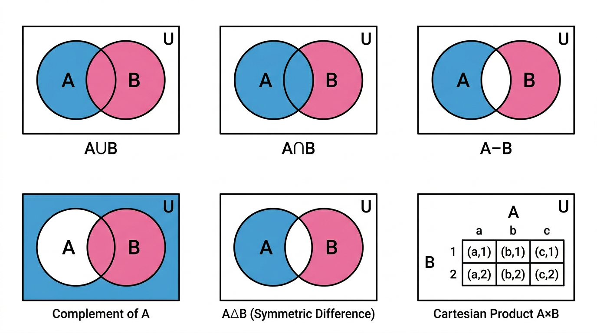

# Sets

> COMP0147 Discrete Mathematics — UCL Year 1

## Motivation: Von Neumann Construction

Natural numbers built purely from sets:

\[
0 = \varnothing, \quad 1 = \{\varnothing\}, \quad 2 = \{\varnothing, \{\varnothing\}\}, \quad 3 = \{\varnothing, \{\varnothing\}, \{\varnothing, \{\varnothing\}\}\}, \;\ldots
\]

Successor: \(S(n) = n \cup \{n\}\). Each natural number equals the set of all smaller naturals.

## Sets — Basics

A **set** is an unordered collection of distinct objects.

- \(a \in A\): \(a\) is an element of \(A\).
- \(a \notin A\): \(a\) is not an element of \(A\).

**Ways to define a set:**

| Method | Example |
|--------|---------|
| Listing (roster) | \(\{1, 2, 3\}\) |
| Set-builder | \(\{x \in \mathbb{Z} : x^2 < 10\}\) |
| Recursive | Base + recursive step + exclusion |
| Characteristic function | \(\chi_A(x) = 1\) iff \(x \in A\) |

## Important Sets

\(\mathbb{N}\) (naturals), \(\mathbb{Z}\) (integers), \(\mathbb{Z}^+\) (positive integers), \(\mathbb{Q}\) (rationals), \(\mathbb{R}\) (reals), \(\mathbb{R}^*\) (nonzero reals), \(\mathbb{R}^+\) (positive reals), \(\mathbb{C}\) (complex numbers).

## Set Equality

\[
A = B \;\iff\; \forall x\,(x \in A \leftrightarrow x \in B)
\]

In practice: show \(A \subseteq B\) and \(B \subseteq A\).

## Subsets

\[
A \subseteq B \;\iff\; \forall x\,(x \in A \rightarrow x \in B)
\]

**Proper subset:** \(A \subset B\) iff \(A \subseteq B\) and \(A \neq B\).

## Empty Set

\(\varnothing = \{\}\). Key properties:

- \(\varnothing \subseteq A\) for every set \(A\) (vacuously true).
- The empty set is **unique**.
- \(\varnothing \neq \{\varnothing\}\) — the latter has one element.

## Power Set

\[
\mathcal{P}(A) = \{S : S \subseteq A\}
\]

\(|\mathcal{P}(A)| = 2^{|A|}\). Always contains \(\varnothing\) and \(A\) itself.

## Tuples

Unlike sets, tuples are **ordered** and **allow repetitions**.

\((a_1, a_2, \ldots, a_n) = (b_1, b_2, \ldots, b_m)\) iff \(n = m\) and \(a_i = b_i\) for all \(i\).

## Cartesian Product

\[
A \times B = \{(a, b) : a \in A,\; b \in B\}
\]

- \(|A \times B| = |A| \cdot |B|\).
- Generalises to \(n\) sets: \(A_1 \times A_2 \times \cdots \times A_n\).
- \(A \times \varnothing = \varnothing\).
- Not commutative in general: \(A \times B \neq B \times A\) (unless \(A = B\) or one is empty).

## Set Operations

| Operation | Notation | Definition |
|-----------|----------|------------|
| Union | \(A \cup B\) | \(\{x : x \in A \lor x \in B\}\) |
| Intersection | \(A \cap B\) | \(\{x : x \in A \land x \in B\}\) |
| Difference | \(A - B\) | \(\{x : x \in A \land x \notin B\}\) |
| Complement | \(A^c\) or \(\overline{A}\) | \(\{x \in U : x \notin A\}\) (relative to universe \(U\)) |

## Proving Set Equality

Three main approaches:

1. **Double inclusion:** Show \(A \subseteq B\) and \(B \subseteq A\).
2. **Element chasing:** Take arbitrary \(x\), show \(x \in A \iff x \in B\).
3. **Membership tables:** Truth-table style; columns for membership in each set, check rows match.

## De Morgan's Laws for Sets

\[
(A \cap B)^c = A^c \cup B^c \qquad\qquad (A \cup B)^c = A^c \cap B^c
\]

## Table of Set Identities

| Identity | Law |
|----------|-----|
| \(A \cup B = B \cup A\), \(A \cap B = B \cap A\) | Commutativity |
| \((A \cup B) \cup C = A \cup (B \cup C)\) | Associativity |
| \(A \cup (B \cap C) = (A \cup B) \cap (A \cup C)\) | Distributivity |
| \(A \cap (B \cup C) = (A \cap B) \cup (A \cap C)\) | Distributivity |
| \(A \cup \varnothing = A\), \(A \cap U = A\) | Identity |
| \(A \cup U = U\), \(A \cap \varnothing = \varnothing\) | Domination |
| \(A \cup A = A\), \(A \cap A = A\) | Idempotence |
| \((A^c)^c = A\) | Double complement |
| \(A \cup (A \cap B) = A\), \(A \cap (A \cup B) = A\) | Absorption |
| \(A \cup A^c = U\), \(A \cap A^c = \varnothing\) | Complement |

## Disjoint Sets and Partitions

- **Disjoint:** \(A \cap B = \varnothing\).
- **Mutually disjoint:** A collection \(\{A_i\}\) where \(A_i \cap A_j = \varnothing\) for all \(i \neq j\).
- **Partition** of \(S\): a collection of non-empty, mutually disjoint subsets whose union is \(S\).
