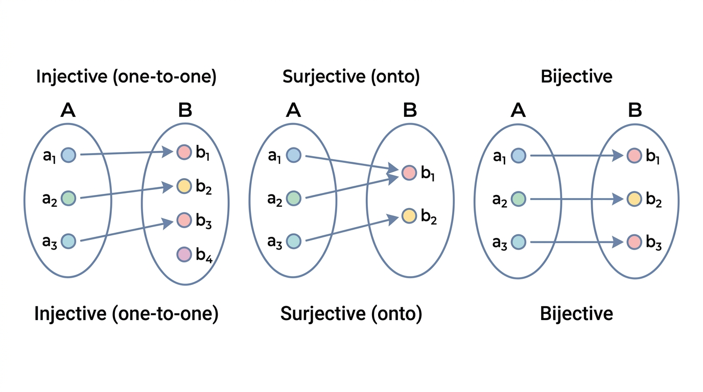

# Functions and Sequences

> COMP0147 Discrete Mathematics — UCL Year 1

## Functions

A **function** \(f : A \to B\) assigns to each \(a \in A\) exactly one element \(f(a) \in B\).

| Term | Meaning |
|------|---------|
| Domain | \(A\) — the set of inputs |
| Co-domain | \(B\) — the set of possible outputs |
| Image of \(a\) | \(f(a)\) |
| Image / range of \(f\) | \(\{f(a) : a \in A\} \subseteq B\) |
| Inverse image of \(S \subseteq B\) | \(f^{-1}(S) = \{a \in A : f(a) \in S\}\) |

## Well-Definedness

A rule is **not** a function if equal inputs can produce different outputs. Always check:

- Is every element of the domain assigned an output?
- Is the output unique for each input?

## Injective (One-to-One)

\[
f(a_1) = f(a_2) \;\Longrightarrow\; a_1 = a_2
\]

Equivalently: distinct inputs map to distinct outputs. To **disprove**, find a single pair with \(a_1 \neq a_2\) but \(f(a_1) = f(a_2)\).

## Surjective (Onto)

\[
\forall b \in B,\; \exists a \in A,\; f(a) = b
\]

Every element of the co-domain is hit. To **disprove**, find one \(b \in B\) with no preimage.

## Bijective

\(f\) is **bijective** iff it is both injective and surjective. Bijections establish a one-to-one correspondence between \(A\) and \(B\).

## Inverse Function

\(f^{-1} : B \to A\) exists **iff** \(f\) is bijective.

\[
f^{-1}(y) = x \;\iff\; f(x) = y
\]

If \(f\) is bijective, then \(f^{-1}\) is also bijective.

## Composition

\[
(f \circ g)(a) = f(g(a))
\]

Apply \(g\) first, then \(f\). Requires the co-domain of \(g\) to be compatible with the domain of \(f\).

**Key properties:**

- Composition of injections is injective.
- Composition of surjections is surjective.
- Composition of bijections is bijective.
- Composition is associative: \(f \circ (g \circ h) = (f \circ g) \circ h\).
- **Not** commutative in general.

## Identity Function

\[
\iota_A : A \to A, \qquad \iota_A(a) = a
\]

For a bijection \(f : X \to Y\):

\[
f^{-1} \circ f = \iota_X \qquad\text{and}\qquad f \circ f^{-1} = \iota_Y
\]

## Floor and Ceiling

\[
\lfloor x \rfloor = \max\{n \in \mathbb{Z} : n \leq x\} \qquad\qquad \lceil x \rceil = \min\{n \in \mathbb{Z} : n \geq x\}
\]

**Key properties:**

- \(\lfloor -x \rfloor = -\lceil x \rceil\)
- \(x - 1 < \lfloor x \rfloor \leq x \leq \lceil x \rceil < x + 1\)
- If \(x \in \mathbb{Z}\): \(\lfloor x \rfloor = \lceil x \rceil = x\)

## Partial Functions

A **partial function** \(f : A \rightharpoonup B\) is defined only on a subset \(D \subseteq A\) (its **domain of definition**). For \(a \notin D\), \(f(a)\) is undefined.

Example: \(f : \mathbb{Z} \to \mathbb{R}\) given by \(f(n) = 1/n\) is partial (undefined at 0).

## Sequences

A **sequence** is a function from \(\mathbb{N}\) (or a subset) to a set \(S\). Written \((a_n)_{n \geq 0}\) or \(a_0, a_1, a_2, \ldots\)

### Arithmetic Progression

\(a_n = a_0 + nd\), where \(d\) is the common difference.

### Geometric Progression

\(a_n = a_0 \cdot r^n\), where \(r\) is the common ratio.

### Explicit vs Recursive Formulas

- **Explicit:** \(a_n\) given directly in terms of \(n\) (e.g. \(a_n = 2^n - 1\)).
- **Recursive:** \(a_n\) defined in terms of previous terms (e.g. \(a_n = 2a_{n-1} + 1\), \(a_0 = 0\)).

Use induction to prove a recursive formula matches a conjectured explicit formula.

## Summations

\[
\sum_{i=m}^{n} a_i = a_m + a_{m+1} + \cdots + a_n
\]

**Properties:**

- \(\displaystyle\sum_{i=m}^{n}(a_i + b_i) = \sum_{i=m}^{n}a_i + \sum_{i=m}^{n}b_i\)
- \(\displaystyle\sum_{i=m}^{n} c \cdot a_i = c \cdot \sum_{i=m}^{n} a_i\)
- If \(m > n\), the sum is 0 (empty sum).

## Products

\[
\prod_{i=m}^{n} a_i = a_m \cdot a_{m+1} \cdots a_n
\]

If \(m > n\), the product is 1 (empty product). Factorial as a product: \(n! = \prod_{i=1}^{n} i\).
