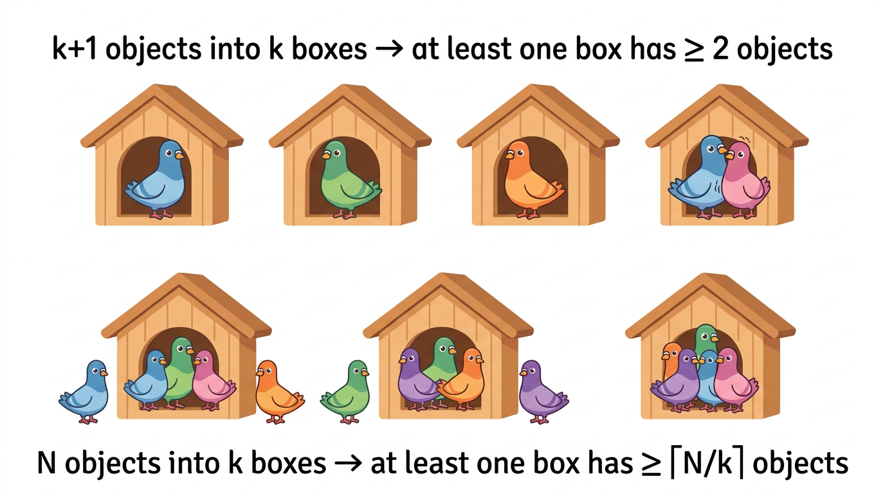
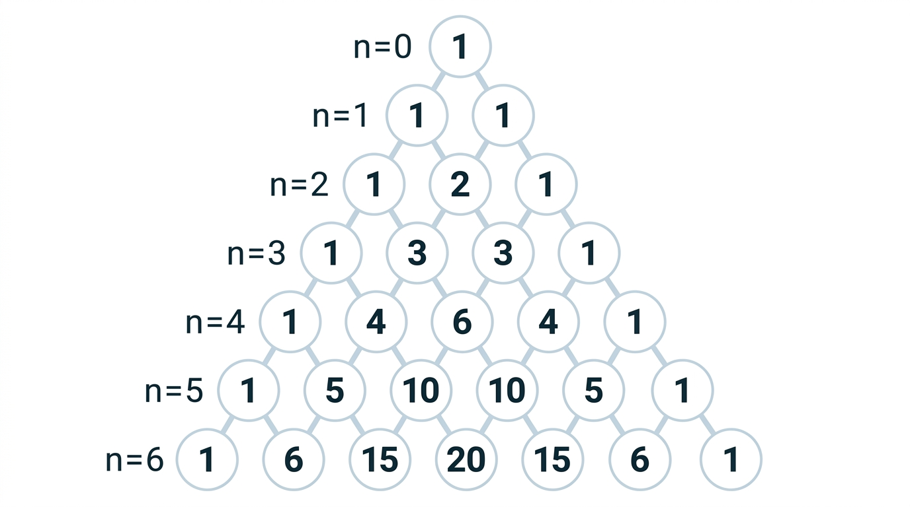
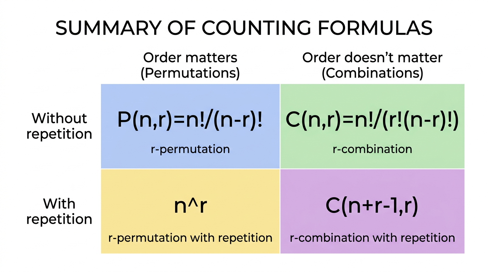

# Counting

> COMP0147 Discrete Mathematics — UCL Year 1

## Multiplication Principle (Product Rule)

If a procedure consists of \( k \) consecutive steps where step \( i \) can be done in \( n_i \) ways, the total number of ways is:

\[ n_1 \cdot n_2 \cdot \ldots \cdot n_k \]

**Key requirement:** the number of ways for each step must be independent of choices made in previous steps.

## Addition Principle (Sum Rule)

If a task can be done by choosing **one** of \( k \) **disjoint** alternatives with \( n_1, n_2, \ldots, n_k \) possibilities respectively:

\[ n_1 + n_2 + \ldots + n_k \]

Only applies when the alternatives share no outcomes (mutually exclusive).

## Inclusion-Exclusion

For two sets:

\[ |A \cup B| = |A| + |B| - |A \cap B| \]

For three sets:

\[ |A \cup B \cup C| = |A|+|B|+|C| - |A \cap B| - |A \cap C| - |B \cap C| + |A \cap B \cap C| \]

Pattern: add singles, subtract pairs, add triples, ... (alternating signs).

## Possibility Trees

When consecutive steps have **variable** numbers of options depending on earlier choices, draw a tree where each branch represents one option. The total number of outcomes is the number of leaves.

Useful when the product rule doesn't directly apply because later steps depend on earlier choices.

## Pigeonhole Principle

If \( k+1 \) objects are placed into \( k \) boxes, at least one box contains **at least 2** objects.

### Generalised Pigeonhole Principle

If \( N \) objects are placed into \( k \) boxes, at least one box contains at least \( \lceil N/k \rceil \) objects.

### Applications

- **Birthdays:** among 367 people, at least 2 share a birthday (366 possible days + leap day)
- **Same first letter:** among 27 English words, at least 2 start with the same letter (26 letters)
- **Zodiac signs:** among 13 people, at least 2 share a zodiac sign (12 signs)
- **Subsets with equal sums:** certain collections of integers must contain distinct subsets with equal sums
- **Mutual friends/enemies (Ramsey-type):** among 6 people, there must exist 3 mutual friends or 3 mutual strangers (colour edges of \( K_6 \) with 2 colours → monochromatic triangle)

## Permutations

An **ordered** arrangement of \( r \) elements chosen from \( n \) distinct elements:

\[ P(n,r) = \frac{n!}{(n-r)!} \]

Special case: \( P(n,n) = n! \) (permutations of all elements).

### Circular Permutations

Arrangements around a circle (rotations considered identical):

\[ (n-1)! \]

## Combinations

An **unordered** subset of size \( r \) chosen from \( n \) distinct elements:

\[ C(n,r) = \binom{n}{r} = \frac{n!}{r!(n-r)!} \]

Symmetry: \( C(n,r) = C(n, n-r) \).

### Grid Paths

The number of shortest paths on an \( m \times n \) grid (from one corner to the opposite, moving only right or down) is:

\[ \binom{m+n}{m} \]

(Choose which \( m \) of the \( m+n \) steps are "down".)

## Permutations with Repetition

Choosing an ordered sequence of \( r \) elements from \( n \) types **with replacement**:

\[ n^r \]

## Combinations with Repetition (Stars and Bars)

Choosing an unordered multiset of \( r \) elements from \( n \) types:

\[ \binom{n+r-1}{r} = \binom{n+r-1}{n-1} \]

Think of distributing \( r \) identical stars into \( n \) bins separated by \( n-1 \) bars.

## Permutations with Indistinguishable Objects

Arranging \( n \) objects where there are \( n_1 \) of type 1, \( n_2 \) of type 2, ..., \( n_k \) of type \( k \) (with \( n_1 + \cdots + n_k = n \)):

\[ \frac{n!}{n_1! \, n_2! \, \cdots \, n_k!} \]

## Binomial Theorem

\[ (x+y)^n = \sum_{i=0}^{n} \binom{n}{i} x^{n-i} y^i \]

### Corollaries

- Set \( x = y = 1 \): \( \sum_{k=0}^{n} \binom{n}{k} = 2^n \)
- Set \( x = 1, y = -1 \): \( \sum_{k=0}^{n} (-1)^k \binom{n}{k} = 0 \)

### Proving \( |P(S)| = 2^n \)

Each subset of \( S \) corresponds to a binary string of length \( n \) (include/exclude each element). The total count is \( \sum_{k=0}^{n} \binom{n}{k} = 2^n \).

## Pascal's Identity

\[ \binom{n+1}{k} = \binom{n}{k-1} + \binom{n}{k} \]

**Combinatorial proof:** a subset of size \( k \) from \( n+1 \) elements either contains the \( (n+1) \)-th element (choose remaining \( k-1 \) from \( n \)) or doesn't (choose \( k \) from \( n \)).

## Pascal's Triangle

Each entry is the sum of the two entries above it. Row \( n \) gives \( \binom{n}{0}, \binom{n}{1}, \ldots, \binom{n}{n} \).

## Summary Table

| | Ordered | Unordered |
|---|---|---|
| **Without repetition** | \( P(n,r) = \frac{n!}{(n-r)!} \) | \( C(n,r) = \frac{n!}{r!(n-r)!} \) |
| **With repetition** | \( n^r \) | \( \binom{n+r-1}{r} \) |
