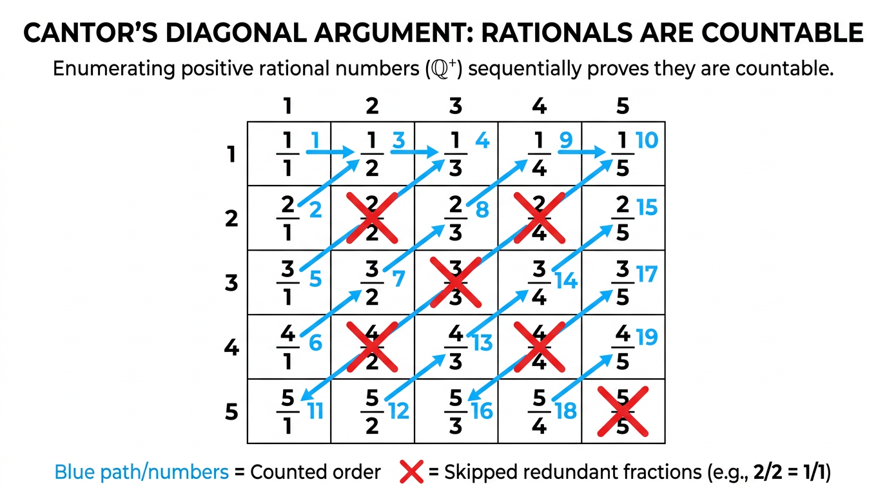
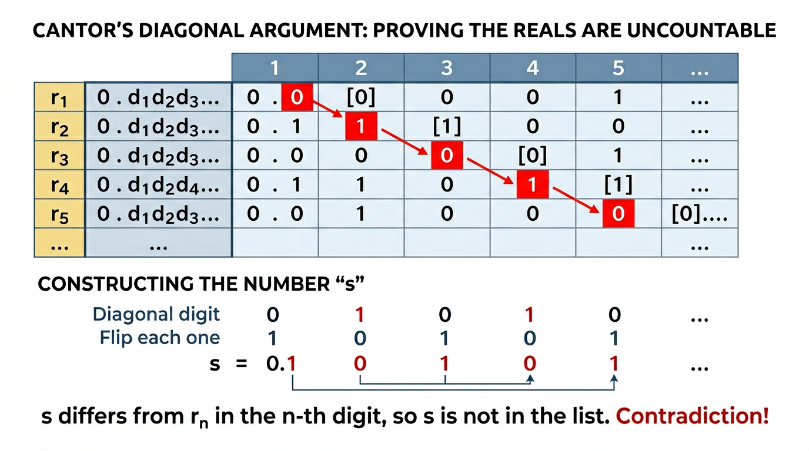

# Cardinality

> COMP0147 Discrete Mathematics — UCL Year 1

## Comparing Sizes of Sets

Two sets have the **same cardinality** iff there exists a bijection between them. This is the fundamental tool for comparing infinite sets.

## Finite Sets

A set \( X \) has cardinality \( n \) (written \( |X| = n \)) if there exists a bijection from \( I_n = \{1, 2, \ldots, n\} \) to \( X \).

### Cantor–Schröder–Bernstein (Finite Case)

For a **finite** set \( X \): a function \( f: X \to X \) is injective **iff** it is surjective.

This fails for infinite sets (e.g. \( f: \mathbb{N} \to \mathbb{N} \) defined by \( f(n) = n+1 \) is injective but not surjective).

## Countable and Uncountable Sets

- **Countable:** a set is countable if it is finite or has the same cardinality as \( \mathbb{N} \) (i.e. its elements can be listed as an infinite sequence).
- **Countably infinite:** countable and infinite (bijection with \( \mathbb{N} \)).
- **Uncountable:** not countable — "too large" to list.

## Hilbert's Hotel

An infinite hotel with rooms \( 1, 2, 3, \ldots \), all occupied.

| Scenario | Solution |
|---|---|
| 1 new guest | Shift everyone: guest in room \( n \) moves to \( n+1 \); new guest takes room 1 |
| Infinitely many new guests | Move guest \( n \) to room \( 2n \); new guests fill odd rooms |
| Infinitely many buses, each with infinitely many guests | Use a pairing function, e.g. guest \( j \) from bus \( i \) goes to room \( 2^i \cdot 3^j \) (or zig-zag enumeration) |

## Showing Specific Sets Are Countable

### Positive Even Numbers \( P = \{2, 4, 6, \ldots\} \)

Bijection \( f: \mathbb{N} \to P \) defined by \( f(n) = 2n \). Hence \( |P| = |\mathbb{N}| \).

### Integers \( \mathbb{Z} \)

List as: \( 0, 1, -1, 2, -2, 3, -3, \ldots \)

Bijection: map \( n \in \mathbb{N} \) to \( \mathbb{Z} \) using a zig-zag pattern.

### Rationals \( \mathbb{Q} \)

Arrange positive rationals in a grid (row = numerator, column = denominator). Traverse with a zig-zag (diagonal) path, skipping fractions that aren't in lowest terms. Extend to all of \( \mathbb{Q} \) by interleaving positives, negatives, and zero.

## Key Properties

- The **union** of two countable sets is countable (interleave the listings).
- Any **subset** of a countable set is countable.
- **Corollary:** any superset of an uncountable set is uncountable.

## \( \mathbb{R} \) Is Uncountable — Cantor's Diagonal Argument

**Proof by contradiction** on the interval \( [0, 1) \):

1. Assume \( [0,1) \) is countable, so list all elements as \( r_1, r_2, r_3, \ldots \)
2. Write each in binary: \( r_i = 0.d_{i1} d_{i2} d_{i3} \ldots \)
3. Construct \( x = 0.x_1 x_2 x_3 \ldots \) where \( x_i \neq d_{ii} \) (flip the \( i \)-th digit of \( r_i \))
4. Then \( x \in [0,1) \) but \( x \neq r_i \) for every \( i \) — contradiction.

Therefore \( [0,1) \) is uncountable, hence \( \mathbb{R} \) is uncountable.

## Computational Consequence

- The set of all **programs** (finite strings over a finite alphabet) is **countable**.
- The set of all **functions** \( \mathbb{N} \to \{0, 1\} \) is **uncountable** (same cardinality as \( \mathcal{P}(\mathbb{N}) \)).
- Therefore, **non-computable functions exist** — there aren't enough programs to compute every function.

## Schröder–Bernstein Theorem (General)

If there exist injections \( f: A \to B \) and \( g: B \to A \), then there exists a bijection between \( A \) and \( B \).

\[ |A| \leq |B| \text{ and } |B| \leq |A| \implies |A| = |B| \]

Useful because finding a bijection directly can be hard; instead find injections in both directions.

## Power Set and Higher Cardinalities

- \( |\mathcal{P}(\mathbb{Z}^+)| = |\mathbb{R}| = 2^{\aleph_0} \)
- **Cantor's Theorem:** for any set \( A \), \( |A| < |\mathcal{P}(A)| \). There is no surjection from \( A \) onto \( \mathcal{P}(A) \).
- This gives an infinite hierarchy of cardinalities: \( |\mathbb{N}| < |\mathcal{P}(\mathbb{N})| < |\mathcal{P}(\mathcal{P}(\mathbb{N}))| < \cdots \)

## Continuum Hypothesis

**Question:** Is there a cardinality strictly between \( |\mathbb{N}| = \aleph_0 \) and \( |\mathbb{R}| = 2^{\aleph_0} \)?

The Continuum Hypothesis asserts **no**. It is **independent** of the standard ZFC axioms — it can neither be proved nor disproved (Gödel 1940, Cohen 1963).
