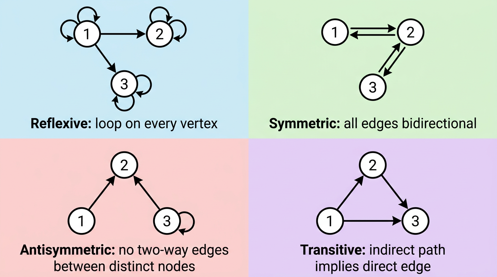
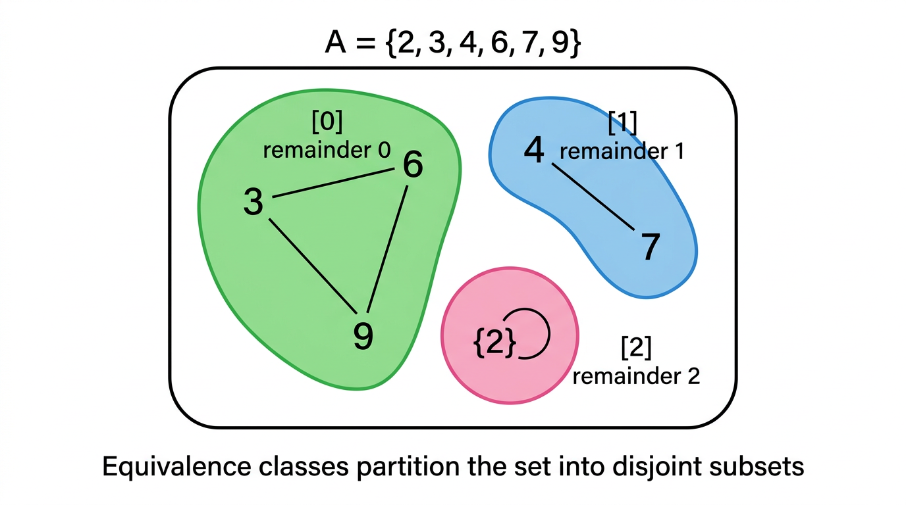
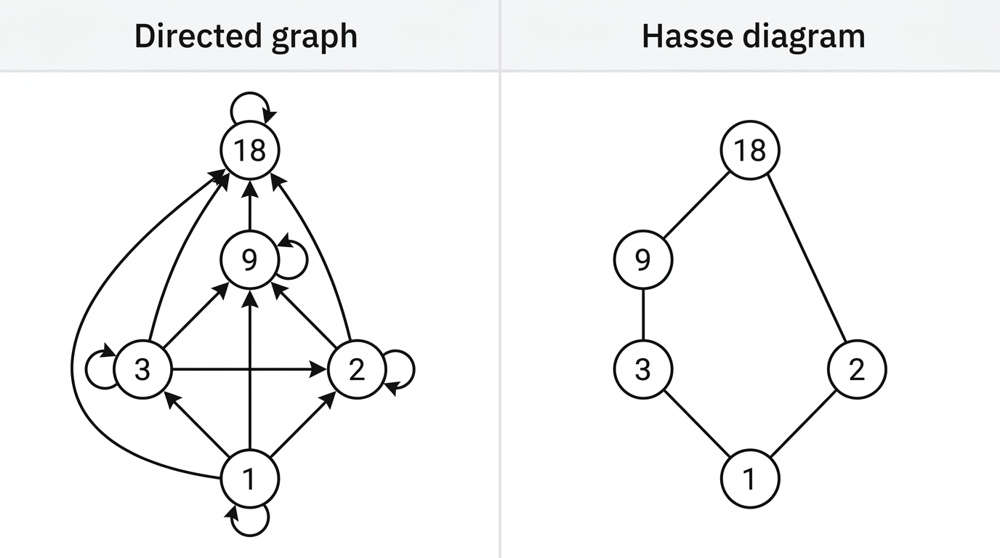

# Relations

> COMP0147 Discrete Mathematics — UCL Year 1

## Binary Relations

A **binary relation** \( R \) from set \( A \) to set \( B \) is a subset \( R \subseteq A \times B \).

We write \( a \mathrel{R} b \) to mean \( (a, b) \in R \).

### Representations

| Representation | Description |
|---|---|
| Set of ordered pairs | \( R = \{(a_1, b_1), (a_2, b_2), \ldots\} \) |
| Arrow diagram (digraph) | Nodes for elements, arrow from \( a \) to \( b \) if \( a \mathrel{R} b \) |
| Boolean matrix \( M_R \) | Entry \( m_{ij} = 1 \) iff \( (a_i, b_j) \in R \) |

### Functions as Special Relations

A relation \( R \subseteq A \times B \) is a function iff it satisfies:
- **Totality:** every \( a \in A \) is related to at least one \( b \)
- **Determinism:** every \( a \in A \) is related to at most one \( b \)

## Relations on a Set

A relation **on** \( A \) is a relation from \( A \) to \( A \), i.e. \( R \subseteq A \times A \).

## Properties of Relations

| Property | Definition | Matrix test | Digraph test |
|---|---|---|---|
| **Reflexive** | \( \forall a \in A,\; (a,a) \in R \) | Diagonal all 1s | Loop at every node |
| **Symmetric** | \( (a,b) \in R \implies (b,a) \in R \) | \( M = M^T \) | Every arrow has a reverse arrow |
| **Antisymmetric** | \( (a,b) \in R \wedge (b,a) \in R \implies a = b \) | \( m_{ij} = 1 \wedge m_{ji} = 1 \implies i = j \) | No pair of opposite arrows (except loops) |
| **Transitive** | \( (a,b) \in R \wedge (b,c) \in R \implies (a,c) \in R \) | — | If path of length 2, direct edge exists |

Note: a relation can be **both** symmetric and antisymmetric (e.g. the identity relation).

## Combining Relations

Given \( R_1, R_2 \subseteq A \times B \):
- \( R_1 \cup R_2 \), \( R_1 \cap R_2 \), \( R_1 \setminus R_2 \) — standard set operations
- Boolean matrix: OR, AND, difference respectively

## Composition and Powers

### Composition

Given \( R \subseteq A \times B \) and \( S \subseteq B \times C \):

\[ S \circ R = \{(a, c) \mid \exists\, b \in B : (a,b) \in R \wedge (b,c) \in S\} \]

Matrix computation: Boolean matrix product \( M_{S \circ R} = M_R \odot M_S \) (multiply with AND/OR instead of ×/+).

### Powers

For \( R \) on set \( A \):
- \( R^1 = R \)
- \( R^{n+1} = R^n \circ R \)

\( R \) is transitive **iff** \( R^n \subseteq R \) for all \( n \geq 1 \).

## Closures

The **closure** of \( R \) with respect to a property \( P \) is the smallest relation containing \( R \) that has property \( P \).

| Closure | Formula | Intuition |
|---|---|---|
| **Reflexive** | \( R \cup \Delta \) where \( \Delta = \{(a,a) \mid a \in A\} \) | Add all self-loops |
| **Symmetric** | \( R \cup R^{-1} \) where \( R^{-1} = \{(b,a) \mid (a,b) \in R\} \) | Add reverse of every edge |
| **Transitive** | \( R^+ = R \cup R^2 \cup \cdots \cup R^{|A|} \) | Add edges for all paths |

For transitive closure: we can stop at \( R^{|A|} \) because any path of length \( > |A| \) must revisit a vertex.

## Equivalence Relations

A relation that is **reflexive**, **symmetric**, and **transitive**.

### Equivalence Classes

\[ [a]_R = \{b \in A \mid (a,b) \in R\} \]

- Any element of the class is a **representative**.
- Two classes are either **identical** or **disjoint**.
- The equivalence classes **partition** \( A \) (and conversely, every partition induces an equivalence relation).

### Example: Congruence Modulo \( n \)

\( a \equiv b \pmod{n} \) iff \( n \mid (a - b) \).

Equivalence classes: \( [0], [1], \ldots, [n-1] \) — these are the residue classes modulo \( n \).

## Partial Orders

A relation that is **reflexive**, **antisymmetric**, and **transitive**.

A **poset** is a pair \( (S, \preceq) \) where \( \preceq \) is a partial order on \( S \).

### Examples

- \( (\mathbb{R}, \leq) \) — the usual ordering on reals
- \( (\mathbb{Z}^+, \mid) \) — divisibility on positive integers

### Comparable Elements

Elements \( a, b \) are **comparable** if \( a \preceq b \) or \( b \preceq a \); otherwise **incomparable**.

A partial order where every pair is comparable is a **total (linear) order**.

### Lexicographic Order

On sequences \( (a_1, \ldots, a_n) \): compare component by component from left to right; the first position where they differ determines the order.

### Hasse Diagrams

A visual representation of a poset with simplifications:
1. **Omit loops** (reflexivity is assumed)
2. **Omit transitive edges** (only draw "covering" relations: \( a \prec b \) with nothing in between)
3. **Assume upward direction** (if \( a \prec b \), draw \( b \) above \( a \); no arrowheads needed)
