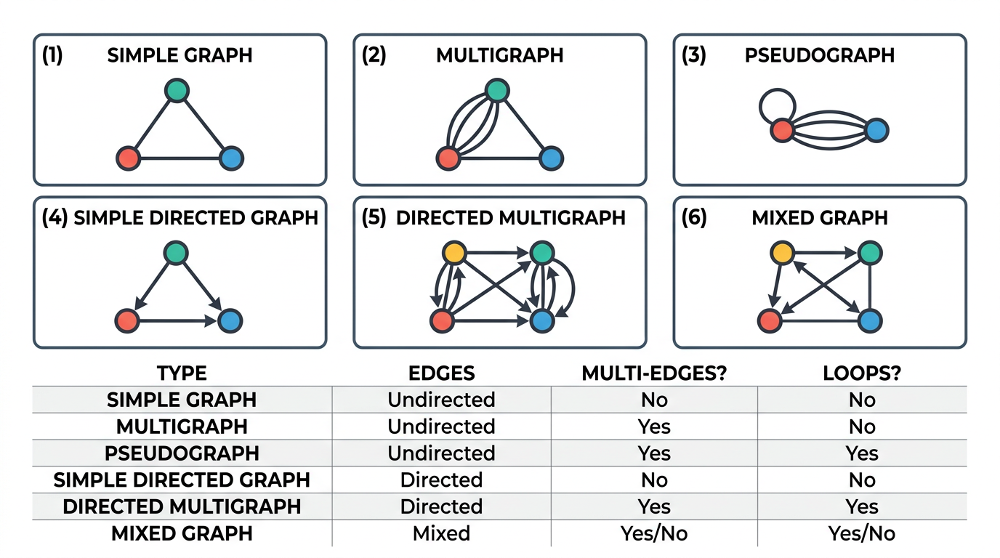
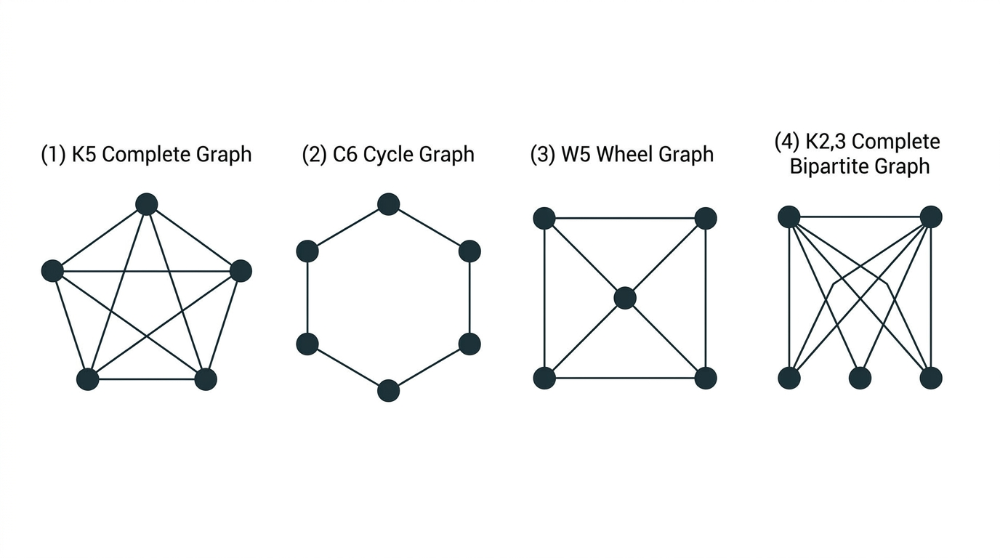
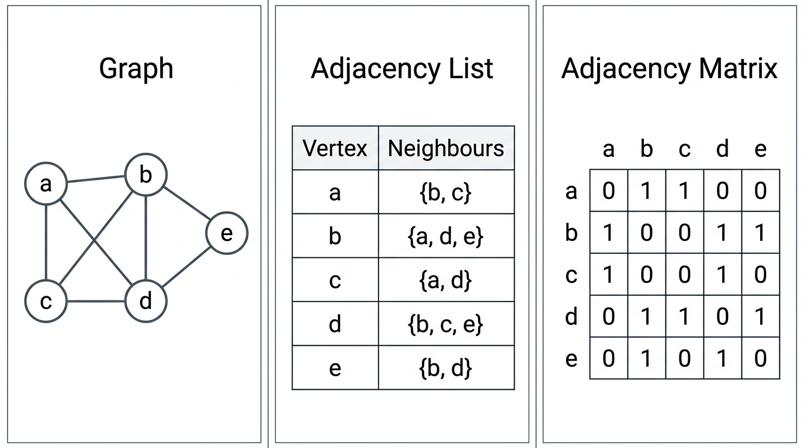
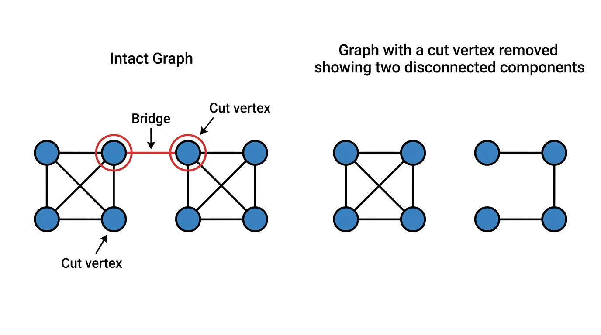

# Graphs

> COMP0147 Discrete Mathematics — UCL Year 1

## Motivation

The **Königsberg bridges problem** (Euler, 1736): is there a walk crossing each of the 7 bridges exactly once? Euler proved no — this was the birth of graph theory.

## Basic Definition

A **graph** \( G = (V, E) \) consists of a set \( V \) of **vertices** and a set \( E \) of **edges** connecting pairs of vertices.

## Types of Graphs

| Type | Multiple edges | Loops | Directed |
|---|---|---|---|
| Simple graph | No | No | No |
| Multigraph | Yes | No | No |
| Pseudograph | Yes | Yes | No |
| Directed graph (digraph) | No | Yes | Yes |
| Directed multigraph | Yes | Yes | Yes |
| Mixed graph | Possible | Possible | Some edges directed, some not |

## Graph Models

- **Social networks:** vertices = people, edges = friendships/interactions
- **Web graphs:** vertices = pages, directed edges = hyperlinks
- **Citation networks:** vertices = papers, directed edges = citations
- **Transportation:** vertices = locations, edges = roads/routes
- **Biological:** protein interaction networks, neural networks

## Terminology

- **Adjacent** vertices: connected by an edge
- **Incident** edge: an edge \( e = \{u, v\} \) is incident with \( u \) and \( v \)
- **Neighbourhood** \( N(v) \): set of all vertices adjacent to \( v \)
- **Degree** \( \deg(v) \): number of edges incident with \( v \); a **loop contributes 2** to the degree

### Handshaking Theorem

\[ 2|E| = \sum_{v \in V} \deg(v) \]

**Consequences:**
- The sum of all degrees is always **even**
- The number of vertices with **odd degree** is always **even**

### Directed Graphs

- **In-degree** \( \deg^-(v) \): number of edges **into** \( v \)
- **Out-degree** \( \deg^+(v) \): number of edges **out of** \( v \)

\[ \sum_{v \in V} \deg^-(v) = \sum_{v \in V} \deg^+(v) = |E| \]

## Special Graphs

### Complete Graph \( K_n \)

Every pair of vertices is connected. Edges: \( \binom{n}{2} = \frac{n(n-1)}{2} \). Every vertex has degree \( n-1 \).

### Cycle \( C_n \)

\( n \) vertices forming a single cycle. Every vertex has degree 2. Edges: \( n \).

### Wheel \( W_n \)

\( C_{n-1} \) plus a central **hub** vertex connected to all others. Vertices: \( n \). Hub has degree \( n-1 \); rim vertices have degree 3.

### Bipartite Graphs

\( V = V_1 \cup V_2 \) with edges only between \( V_1 \) and \( V_2 \) (no edges within a partition).

**Equivalent characterisations:**
- \( G \) is 2-colourable
- \( G \) contains **no odd cycles**

### Complete Bipartite \( K_{m,n} \)

Every vertex in \( V_1 \) (size \( m \)) is connected to every vertex in \( V_2 \) (size \( n \)). Edges: \( m \cdot n \).

### Regular Graphs

Every vertex has the same degree \( k \) (called \( k \)-regular). \( K_n \) is \( (n-1) \)-regular. \( C_n \) is 2-regular.

## Representations

| Representation | Space | Notes |
|---|---|---|
| **Adjacency list** | \( O(V + E) \) | For each vertex, list its neighbours; efficient for sparse graphs |
| **Adjacency matrix** | \( O(V^2) \) | \( a_{ij} = 1 \) if edge between \( i \) and \( j \); symmetric for undirected graphs |
| **Incidence matrix** | \( O(V \cdot E) \) | Rows = vertices, columns = edges; entry 1 if vertex is incident with edge |

## Graph Isomorphism

Graphs \( G_1 = (V_1, E_1) \) and \( G_2 = (V_2, E_2) \) are **isomorphic** if there exists a bijection \( f: V_1 \to V_2 \) such that \( \{u, v\} \in E_1 \iff \{f(u), f(v)\} \in E_2 \).

### Invariants (Necessary but NOT Sufficient)

If \( G_1 \cong G_2 \), then they must agree on:
- \( |V| \), \( |E| \)
- Degree sequence (sorted list of all degrees)
- Number of connected components
- Subgraph structure (e.g. cycle lengths)

Matching invariants does **not** prove isomorphism — you must exhibit the bijection or use other methods.

## Connectivity

### Paths and Circuits

- **Path:** sequence of edges connecting a sequence of distinct vertices
- **Simple path:** no repeated vertices
- **Circuit (cycle):** a path that starts and ends at the same vertex
- **Simple circuit:** no repeated vertices (except start = end)

### Connected Graphs

A graph is **connected** if there is a path between every pair of vertices. Otherwise it has multiple **connected components**.

### Cut Vertices and Bridges

- **Cut vertex (articulation point):** removing it disconnects the graph (increases the number of components)
- **Bridge (cut edge):** removing it disconnects the graph
- **Separating set:** a set of vertices whose removal disconnects the graph

### Vertex and Edge Connectivity

- **Vertex connectivity** \( \kappa(G) \): minimum number of vertices whose removal disconnects \( G \) (or reduces it to a single vertex)
- **Edge connectivity** \( \lambda(G) \): minimum number of edges whose removal disconnects \( G \)

### Whitney's Inequality

\[ \kappa(G) \leq \lambda(G) \leq \min_{v \in V} \deg(v) \]

### \( k \)-Connected Graphs

A graph is **\( k \)-connected** if \( \kappa(G) \geq k \), meaning it remains connected after removing any \( k-1 \) vertices.

## Directed Connectivity

- **Strongly connected:** for every pair \( u, v \), there is a directed path from \( u \) to \( v \) **and** from \( v \) to \( u \)
- **Weakly connected:** the underlying undirected graph (ignore arrow directions) is connected

Every strongly connected digraph is weakly connected, but not vice versa.
