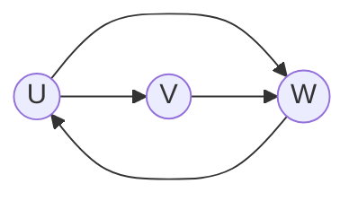

# graphs and graph models

## what is a graph?
- a graph $G = (V, E)$ consists of:
  - a nonempty set $V$ of vertices or nodes
  - a set $E$ of edges. each edge has either one or two vertices associated with it, called its `endpoints`

    ```mermaid
    graph LR
        A((A)) --- B((B))
        B((B)) --- C((C))
        C((C)) --- A((A))
    ```
    $V = \set{A, B, C}$
    $E = \set{\set{A, B}, \set{B, C}, \set{A, C}}$

## type of undirected graphs
1. simple graph
   - each edge connects two different vertices
   - at most one edge between any pair
    ```mermaid
        graph LR
        1((1)) --- 2((2))
        3((3)) --- 2((2))
    ```
2. multigraph
    - multiple edges allowed between same pair of vertices
    - useful for modelling redundant connections
    ```mermaid 
    graph LR
        1((1)) --- 2((2))
        3((3)) --- 2((2))
        2((2)) --- 1((1))
    ```
3. pseudograph
    - allows loops: edges that connect a vertex to itself
    - allows multiple edges
    ```mermaid
    graph LR
        A((A)) --- B((B))
        A((A)) --- A((A))
        B((B)) --- A((A))
    ```

## directed graphs
> edges are ordered pairs $(u, v)$; edges go from $u$ to $v$
1. simple directed graph
    - no multiple edges in same direction
    - $(u, v)$ is distinct from $(v, u)$
2. directed multigraph
    - allows multiple edges in the exact same direction


# graph terminology

## undirected graphs: adjacency
- adjacent (neighbours): 
  - two vertices $u$ and $v$ are adjacent if $\set{u, v}$ is an edge in $E$
- incident:
  - an edge $e$ is incident with the vertices $u$ and $v$ if $e = \set{u, v}$
- set of neighbours $N(v)$: 
  - the set of all vertices adjacent to $v$

## degree and the handshaking theorem
- degree:
  > the degree of a vertex $v$, denoted $\text{deg}(v)$, is the number of edges incident with it
  - a loop at a vertex contributes `2` to the degree of that vertex
- theorem 1: handshaking theorem
    let $G = (V, E)$ be an undirected graph with $m$ edges. then:
    $$ 2|E| = \sum_{v \in V} \text{deg}(v)$$
    <br>
    each edge contribute two to the sum of the degrees of the vertices because ane dge is incident with exactly two (possibly equal) vertices
    
    this means that the sum of the degrees of the vertices is twice the number of edges

## degrees in directed graphs
- `indegree` $deg^-(v)$ 
  - number of edges `ending` at $v$
  - $v$ is the terminal vertex
- `outdegree` $deg^+(v)$
  - number of edges starting at $v$
  - $v$ is the initial vertex
- theorem 2: for a directed graph $G = (V, E)$:
  $$ \sum_{v \in V} \text{deg}^-(v) = \sum_{v \in V} \text{deg}^+(v) = |E|$$

## complete graphs $(K_n)$
- a complete graph on $n$ vertices, denoted $K_n$, is a simple graph that contains exactly one edge between each pair of distinct vertices
  - $K_n$ is the "most dense" simple graph possible on $n$ vertices
  - number of edges in $K_n = \frac{n(n-1)}{2}= n\text{C}2$

## cycles and wheels 
- cycle $(C_n)$:
  - $n \geq 3$ vertices
  - $\text{deg}(v) = 2$ for all vertices 
- wheel $(W_n)$
  - constructed by adding one central vertex (hub) to $C_{n-1} \space (n \geq 4)$
  - the central vertex is connected to every vertex on the cycle

## bipartite graphs
a simple graph $G$ is `bipartite` if $V$ can be partitioned into two disjoint and non-empty sets $V_1$ and $V_2$, such that:
- every edge connects a vertex in $V_1$ to one in $V_2$
- no edges exist within $V_1$ or within $V_2$
