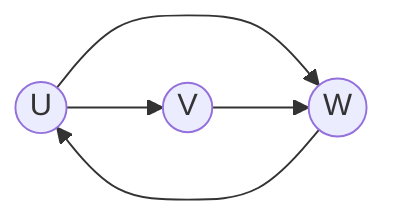
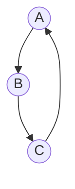
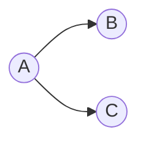
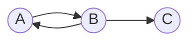

# graphs and graph models

## what is a graph?
- a graph $G = (V, E)$ consists of:
  - a nonempty set $V$ of vertices or nodes
  - a set $E$ of edges. each edge has either one or two vertices associated with it, called its `endpoints`

    ```mermaid
    graph LR
        A((A)) --- B((B))
        B((B)) --- C((C))
        C((C)) --- A((A))
    ```
    $V = \set{A, B, C}$
    $E = \set{\set{A, B}, \set{B, C}, \set{A, C}}$

## type of undirected graphs
1. simple graph
   - each edge connects two different vertices
   - at most one edge between any pair
    ```mermaid
        graph LR
        1((1)) --- 2((2))
        3((3)) --- 2((2))
    ```
2. multigraph
    - multiple edges allowed between same pair of vertices
    - useful for modelling redundant connections
    ```mermaid 
    graph LR
        1((1)) --- 2((2))
        3((3)) --- 2((2))
        2((2)) --- 1((1))
    ```
3. pseudograph
    - allows loops: edges that connect a vertex to itself
    - allows multiple edges
    ```mermaid
    graph LR
        A((A)) --- B((B))
        A((A)) --- A((A))
        B((B)) --- A((A))
    ```

## directed graphs
> edges are ordered pairs $(u, v)$; edges go from $u$ to $v$
1. simple directed graph
    - no multiple edges in same direction
    - $(u, v)$ is distinct from $(v, u)$
2. directed multigraph
    - allows multiple edges in the exact same direction


# graph terminology

## undirected graphs: adjacency
- adjacent (neighbours): 
  - two vertices $u$ and $v$ are adjacent if $\set{u, v}$ is an edge in $E$
- incident:
  - an edge $e$ is incident with the vertices $u$ and $v$ if $e = \set{u, v}$
- set of neighbours $N(v)$: 
  - the set of all vertices adjacent to $v$

## degree and the handshaking theorem
- degree:
  > the degree of a vertex $v$, denoted $\text{deg}(v)$, is the number of edges incident with it
  - a loop at a vertex contributes `2` to the degree of that vertex
> theorem 1: handshaking theorem
    let $G = (V, E)$ be an undirected graph with $m$ edges. then:
    $$ 2|E| = \sum_{v \in V} \text{deg}(v)$$
    <br>
    each edge contribute two to the sum of the degrees of the vertices because ane dge is incident with exactly two (possibly equal) vertices
    this means that the sum of the degrees of the vertices is twice the number of edges

## degrees in directed graphs
- `indegree` $deg^-(v)$ 
  - number of edges `ending` at $v$
  - $v$ is the terminal vertex
- `outdegree` $deg^+(v)$
  - number of edges starting at $v$
  - $v$ is the initial vertex
> theorem 2: for a directed graph $G = (V, E)$:
  $$ \sum_{v \in V} \text{deg}^-(v) = \sum_{v \in V} \text{deg}^+(v) = |E|$$

## complete graphs $(K_n)$
- a complete graph on $n$ vertices, denoted $K_n$, is a simple graph that contains exactly one edge between each pair of distinct vertices
  - $K_n$ is the "most dense" simple graph possible on $n$ vertices
  - number of edges in $K_n = \frac{n(n-1)}{2}= n\text{C}2$

## cycles and wheels 
- cycle $(C_n)$:
  - $n \geq 3$ vertices
  - $\text{deg}(v) = 2$ for all vertices 
- wheel $(W_n)$
  - constructed by adding one central vertex (hub) to $C_{n-1} \space (n \geq 4)$
  - the central vertex is connected to every vertex on the cycle

## bipartite graphs
a simple graph $G$ is `bipartite` if $V$ can be partitioned into two disjoint and non-empty sets $V_1$ and $V_2$, such that:
- every edge connects a vertex in $V_1$ to one in $V_2$
- no edges exist within $V_1$ or within $V_2$

> theorem 3:
a simple graph is bipartite if and only if it is possible to assign one of two different colours to each vertex of the graph so that no two adjacent vertices are assigned the same colour

>theorem 4: 
a simple graph $G$ is bipartite if and only if it is not possible to start at a vertex and return to this vertex by traversing an odd number of distinct edges

## complete bipartite graphs $(K_{m, n})$
> definition:
a complete bipartite graph $K_{m, n}$ is a bipartite graph where very vertex in the first set $(V_1, |V_1| = m)$ is connected to every vertex in the second set $(V_2, |V_2| = m)$
- the total number of vertices is $m + n$
- the total number of edges is $m \cdot n$

## regular graphs
> a graph is regular if every vertex has the same degree
  - if every vertex has degree $k$, then the graph is $k$-regular

# representing graphs

## adjacency list
> an adjacency list specifies the vertices that are adjacent to each vertex in the graph
- best for: sparse graphs (few edges)
- storage: $O(|V| + |E|)$

## adjacency matrixes
> for a graph $G = (V, E)$ with vertices $v_1, v_2, \dots, v_n$ the adjacency matrix $A$ is an $n \times n$ matrix where: 
$$ a_{ij} = \begin{cases}
1 \text{ if } \set{v_i, v_j} \text{ is an edge} \\
0 \text { otherwise}
\end{cases}$$
- symmetric if undirected
- storage: $O(|V|^2)$; good for dense graphs
- loops result in $1$s on the diagonal

## incidence matrix
> let $G = (V, E)$ with vertices $v_1, v_2, \dots, v_n$ and edges $e_1, e_2, \dots, e_m$. 
> the incidence matrix $M$ s an $n \times m$ matrix where: $$ m_{ij} \begin{cases} 1 \text{ if edge } e_j \text{ is incident with } v_i \\ 0 \text{ otherwise } \end{cases}$$
- columns represent edges
- each column sums to 2 (for simple graphs)

## graph isomorphism

### the core concept
two graphs may look different but share the exact same structure

### formal definition
the simple graphs $G_1 = (V_1, E_1)$ and $G_2 = (V_2, E_2)$ are `isomorphic` $(G_1 \simeq G_2)$ if there exists a one-to-one and onto function (bijection) $f : V_1 \rightarrow V_2$ such that: $$ \set{u, v} \in E_1 \leftrightarrow \set{f(u), f(v)} \in E_2$$
<br>
this property is called `preserving adjacency`

## graph invariants
finding the mapping $f$ is hard. it is often easier to prove graphs are not isomorphic by checking `invariants` 
- number of vertices: $|V_1| = |V_2|$
- number of edges: $|E_1| = |E_2|$
- degree sequence: the list of vertex degrees must match
- subgraph: if $G_1$ has a triangle (cycle of length 3), $G_2$ must have a triangle

> Warning
> invariants are necessary but not sufficient. if all variants match, the graphs may not necessarily be isomorphic. we still need to find $f$ to be sure

# connectivity

## paths and circuits
- a path of length $n$ is a sequence of edges that connect a sequence of vertices 
> - a path is simple if it does not contain the same edge more than once
> - a path is a circuit (or cycle) if $n \geq 1$ and $v_0 = v_n$
> - a circuit is simple if it does not contain the same vertex twice aside from the starting/end vertex

## connectedness and components

### connected graph
an undirected graph is connected if there is a path between every pair of distinct vertices in the graph
- the connected components of a graph $G$ are the connected subgraphs of $G$ that are not proper subgraphs of any other connected subgraph of $G$

## cut vertices and bridges

### cut vertex (articulation point)
a vertex $v$ is a cut vertex if its removal (along with all incident edges) increases the number of connected components

### bridge (cut edge)
an edge $e$ is a bridge if its removal increases the numbers of connected components

### separating set
a subset $V'$ of the vertex set $V$ of $G = (V, E)$ is a vertex cut, or separating set, if $G - V'$ is disconnected

## how tough is a graph?
### Kappa: $\kappa(G)$
> Vertex Connectivity: the minimum number of vertices we must delete to disconnect the graph
- $K_n$ has no vertex cuts: removing any subset of its vertices and all incident edges still leaves a complete graph $\rightarrow \kappa(K_n) = n - 1$;
- $0 \leq \kappa(G) \leq n - 1$ if $G$ has $n$ vertices
- $\kappa(G) = 0$ if and only if $G$ is disconnected or $G = K_1$;
- $\kappa(G) = n - 1$ if and only if $G$ is complete
<br>

$k$-connected
a graph is $k$-connected if $\kappa(G) \geq k$. note that if $G$ is a $k$-connected graph, then $G$ is a $j$-connected graph for all $j$ $0 \leq j \leq k$

### Lambda: $\lambda(G)$
> Edge Connectivity: the minimum number of edges we must cut to disconnect the graph
- it is always possible to disconnect a graph by removing all edges incident to one of its vertices
- $\lambda(G) = 0$ if $G$ is not connected or if $G$ is a graph consisting of a single vertex
- if $G$ is a graph with $n$ vertices, then $0 \leq \lambda(G) \leq n - 1$
- $\lambda(G) = n - 1$ if and only if $G = K_n$

### Whitney's inequality:
$$ \text{vertex cut} \leq \text{edge cut} \leq \text{min degree}$$

## one way streets: strong vs weak

- strongly connected: can go anywhere and come back


- weakly connected: connected only if we ignore the direction

## connectivity in directed graphs
path: the path definition is the same, but edges must follow direction

### strongly connected
a directed graph is strongly connected if there is a path from $a$ to $b$ AND a path from $b$ to $a$ between every pair of distinct vertices $a$ and $b$

### weakly connected
a directed graph is weakly connected if the underlying undirected graph (ignoring direction) is connected

example: weakly connected, not strongly connected 

- no path from $C$ to $A$ or $B$ 

# wrap up
- connectivity is about reliability 
1. paths define connection
2. direction matters (strong vs weak)
3. cut vertices/edges represent vulnerabilities
4. $\kappa$ and $\lambda$ gives us a "toughness score"

## key Takeaway
- the connectivity of a graph is a fundamental measure of its robustness, quantifying how many vertices or edges must fail before the graph stops functioning